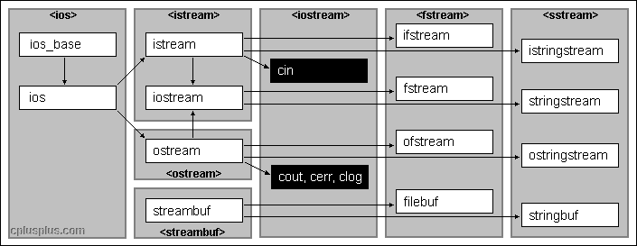

# Input/Output Library



# iomanip

This header file provides parametric manipulators such as:

* setiosflags
* resetiosflags
* setbase
* setfill
* setprecision
* setw
* get\_money
* put\_money
* get\_time
* put\_time

### setiosflags


### resetiosflags


### setbase


### setfill


### setprecision

Sets the decimal precision to be used to format floating-point values on output operations.\
Behaves as if member [precision](http://www.cplusplus.com/ios\_base::precision) were called with n as argument on the stream on which it is inserted/extracted as a manipulator (it can be inserted/extracted on [input streams](http://www.cplusplus.com/basic\_istream) or [output streams](http://www.cplusplus.com/basic\_ostream)).

```cpp
// setprecision example
#include <iostream>     // std::cout, std::fixed
#include <iomanip>      // std::setprecision

int main () {
  double f =3.14159;
  // Without fixed, the parameter '5' denotes the number of valid digits
  // on both before and after decimal point
  std::cout << std::setprecision(5) << f << '\n';
  std::cout << std::setprecision(9) << f << '\n';
  
  // With fixed, the parameter '5' denotes the number of valid digits 
  // after the decimal point.
  std::cout << std::fixed;
  std::cout << std::setprecision(5) << f << '\n';
  std::cout << std::setprecision(9) << f << '\n';
  return 0;
}

Output:
3.1416
3.14159
3.14159
3.141590000
```

### setw


### get\_money


### put\_money


### get\_time


### put\_time


# ios


## Manipulators

* Fixed
* Scientific
* Hexfloat
* defaultfloat

### Hexfloat & Defaultfloat

Sets the floatfield format flag for the str stream to defaultfloat/Hexfloat.\
\
&#x20;When floatfield is set to defaultfloat, floating-point values are written using the default notation: the representation uses as many meaningful digits as needed up to the stream's decimal precision ([precision](http://www.cplusplus.com/ios\_base::precision)), counting both the digits before and after the decimal point (if any).

When floatfield is set to hexfloat, floating-point values are written using hexadecimal format.

```cpp
// hexfloat floatfield
#include <iostream>     // std::cout, std::hexfloat, std::defaultfloat

int main () {
  double a = 3.1415926534;
  double b = 2006.0;
  double c = 1.0e-10;

  std::cout.precision(5);

  std::cout << "hexfloat:\n" << std::hexfloat;
  std::cout << a << '\n' << b << '\n' << c << '\n';

  std::cout << '\n';

  std::cout << "defaultfloat:\n" << std::defaultfloat;
  std::cout << a << '\n' << b << '\n' << c << '\n';

  return 0;
}

Output:
hexfloat:
0x1.921fb5p+1
0x1.f58000p+10
0x1.b7cdfep-34

defaultfloat:
3.14159
2006
1e-010
```

### Fixed & Scientific

Sets the floatfield format flag for the str stream to fixed/Scientific. When floatfield is set to fixed, floating-point values are written using fixed-point notation: **the value is represented with exactly as many digits in the decimal part as specified by the precision field (**[**precision**](http://www.cplusplus.com/ios\_base::precision)**) and with no exponent part.**

Notice that the treatment of the precision field differs between the default floating-point notation and the fixed and scientific notations (see [precision](http://www.cplusplus.com/ios\_base::precision)). On the default floating-point notation, the precision field specifies the maximum number of meaningful digits to display both before and after the decimal point, while in both the fixed and scientific notations, the precision field specifies exactly how many digits to display _after_ the decimal point, even if they are trailing decimal zeros.

```cpp
// modify floatfield
#include <iostream>     // std::cout, std::fixed, std::scientific

int main () {
  double a = 3.1415926534;
  double b = 2006.0;
  double c = 1.0e-10;

  std::cout.precision(5);

  std::cout << "default:\n";
  std::cout << a << '\n' << b << '\n' << c << '\n';

  std::cout << '\n';

  std::cout << "fixed:\n" << std::fixed;
  std::cout << a << '\n' << b << '\n' << c << '\n';

  std::cout << '\n';

  std::cout << "scientific:\n" << std::scientific;
  std::cout << a << '\n' << b << '\n' << c << '\n';
  return 0;
}

Output:

default:
3.1416
2006
1e-010

fixed:
3.14159
2006.00000
0.00000

scientific:
3.14159e+000
2.00600e+003
1.00000e-010
```
